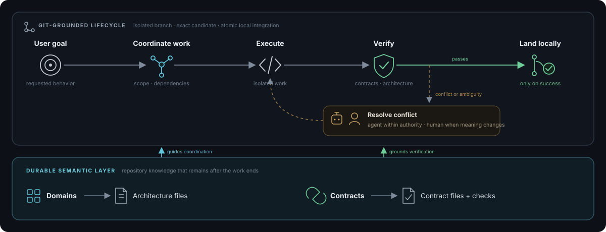

# Invariant

Invariant discovers and maintains durable architectural intent across long-running agentic work.

It connects four concerns that otherwise drift apart:

- **Governed autonomy** — stable architecture and executable contracts let agents act independently
  without weakening cross-domain promises.
- **Guided coordination** — temporary plans, dependencies, and ownership claims steer concurrent
  work through critical domains without becoming architecture.
- **Progressive or intensive discovery** — repositories can learn incrementally as work exposes
  missing context, or through a deliberate upfront audit. Findings remain evidence until resolved.
- **Git-grounded lifecycle** — isolated work, exact-candidate verification, and atomic local landing
  keep long-running changes stable and resumable.

Durable intent is the semantic counterpart to temporal coordination: architecture and contracts
remain after the work ends; plans, claims, and leases do not.



Invariant is a repository-native control plane for coding agents and harnesses, delivered as a
standalone Python CLI. It governs durable intent and verified lifecycle transitions without hosting
or executing the model loop. Humans provide intent, resolve escalated conflicts or ambiguity, and
may control lifecycle transitions; agents handle repository internals. Invariant advances the
integration branch only after exact-candidate verification succeeds and keeps remote publication
disabled by default.

The complete design is in [SPEC.md](SPEC.md).

## Install

Install Invariant directly from its Git repository:

```bash
uv tool install git+https://github.com/RenderBear/invariant-cli.git
```

Or, from the root of a local checkout:

```bash
uv tool install .
```

Confirm the installation:

```bash
invariant --version
```

## Use Invariant

Invariant does not contain or connect to a model. Codex, Claude Code, or another coding harness
provides the model, conversation, and tools; Invariant provides the durable repository context and
verified lifecycle that the harness invokes.

| Actor | Responsibility |
|---|---|
| Human | State the goal and acceptance intent, resolve escalated semantic or merge conflicts, and optionally approve lifecycle transitions. |
| Coding agent or harness | Inspect the code, select relevant paths and domains, implement the change, prepare candidate assessments, and invoke Invariant. |
| Invariant CLI | Retrieve durable context, maintain receipts and coordination state, manage isolated Git work, verify the exact candidate, and land it under repository policy. |

The human does not need to inspect repository internals, choose domains or paths, author assessment
files, or manage branches. Those are agent and Invariant responsibilities.

### Use with a coding agent

Activate Invariant once in the repository's persistent agent instructions. The portable policy
block in [AGENTS.example.md](AGENTS.example.md) can live in `AGENTS.md` for Codex, `CLAUDE.md` for
Claude Code, or the equivalent instruction surface for another coding agent or harness. To share one
copy between Codex and Claude Code, keep it in `AGENTS.md` and add `@AGENTS.md` to `CLAUDE.md`.

The user can then ask for a change normally. The coding agent interprets the goal, invokes the
`invariant` commands through its shell, implements and commits on the branch Invariant creates,
prepares the semantic assessment, and asks Invariant to verify and land the result. When Invariant
needs authority or encounters a real conflict, the agent returns to the human with the decision—not
with a request to investigate the code manually. No Invariant-specific model plugin is required.

### CLI surface

The CLI exists so every coding harness, CI job, and IDE can use the same local, model-independent
protocol. Detailed arguments such as paths, domains, interfaces, governance references, and
candidate assessments are integration fields for those callers; they are not concepts a human is
expected to memorize or enter during normal development.

Humans may use the small operational surface directly—for example, `invariant config show`,
`invariant task status <task-id>`, or `invariant task continue <task-id> --apply`. Harnesses should
use `--format json` for the deeper command contract. Running `invariant` alone does not start an
assistant; without a coding harness, it remains a deterministic repository and automation tool.

## Configure Invariant

Invariant works without a configuration file.

Its effective defaults are:

```yaml
version: 1
resolution: assisted
execution: auto
integration_branch: <current branch>
push_remote: off
lifecycle:
  intent_expansion: false
  outcome_review: false
```

Settings:

| Setting | Default | Values | What it controls |
|---|---|---|---|
| `version` | `1` | `1` | Configuration schema version. It is fixed and not user-configurable. |
| `resolution` | `assisted` | `assisted`, `auto` | Whether consequential semantic ambiguity needs a human or may be settled by an agent acting within accepted authority. |
| `execution` | `auto` | `auto`, `assisted` | Whether state-changing lifecycle transitions run immediately or pause for explicit continuation. |
| `integration_branch` | current branch | local branch name | The branch that receives verified landings. `config init` persists the current branch name. |
| `push_remote` | `off` | `off`, `on` | Whether a successful landing stays local or pushes the exact verified commit to the integration branch's existing upstream. |
| `lifecycle.intent_expansion` | `false` | `false`, `true` | Whether work pauses for explicit outcomes, acceptance criteria, and constraints before implementation. Set with `off` or `on` through the CLI. |
| `lifecycle.outcome_review` | `false` | `false`, `true` | Whether those outcomes must be assessed against the exact candidate before landing. Set with `off` or `on` through the CLI. |

Inspect the resolved values, persist them, or update one setting at a time:

```bash
invariant config show
invariant config init
invariant config set execution assisted
invariant config set integration_branch main
invariant config set push_remote on
invariant config set lifecycle.intent_expansion on
```

## Establish architectural intent

Invariant does not require a complete model up front: start with a full audit, then let normal work
deepen it progressively.

### Start with a full audit (recommended)

Ask your coding agent to audit the repository with Invariant. The agent identifies responsibilities,
boundaries, dependencies, and executable promises, then proposes the domains, architecture
references, and contracts that should govern future work. The human resolves those proposals;
accepted changes establish the repository's durable semantic layer.

### Continue with progressive discovery

During normal work, the agent inspects outward from the goal and surfaces missing, contradictory, or
outdated intent. In assisted mode, the human decides whether each finding should be preserved or
resolved; in auto mode, accepted repository policy allows the agent to proceed when sufficient
authority already exists. Unresolved discoveries remain evidence, while accepted resolutions can
update architecture, contracts, code, tests, or no artifact at all.

## Files and terms

Invariant adds only the state a repository needs:

```text
your-repository/
├── .invariant/
│   ├── config.yml        optional repository configuration
│   ├── DOMAINS.yml       stable responsibilities and architecture pointers
│   ├── CONTRACTS.yml     executable promises between responsibilities
│   ├── discoveries/      non-authoritative evidence from ongoing work
│   └── audits/           non-authoritative broader investigations
└── docs/
    └── architecture.md   ordinary Markdown remains the source of truth
```

- **Domain:** a stable area of responsibility, not necessarily a directory.
- **Architecture:** Markdown that preserves ownership, rationale, state, failure behavior, and
  important restrictions.
- **Contract:** a promise one responsibility relies on from another, connected to executable
  verification.
- **Discovery:** non-authoritative evidence about something missing, contradictory, or not yet
  understood.
- **Audit:** a causally grounded record of what was inspected and found.
- **Task intent:** optional outcomes and acceptance criteria for one local change.
- **Coordination:** temporary dependencies and ownership while parallel work is active.

The short form is:

```text
request
  → retrieve relevant architecture, contracts, and discoveries
  → investigate, coordinate, and implement
  → review architectural impact and run affected checks
  → converge safely

uncertainty
  → discovery evidence
  → intentional resolution
  → architecture, contract, code, tests, documentation, follow-up, or no action
```

## Contributing to Invariant

Set up the source tree:

```bash
uv sync
uv run invariant --version
```

Run the complete verification suite:

```bash
for test_file in tests/test-*.sh; do sh "$test_file" || exit; done
uv run pytest
uv build --no-sources
```

The package implementation lives under `src/invariant/`. Repository-local `intent-*` shell scripts
are deprecated compatibility adapters into that package and are not included in the installed
wheel.
